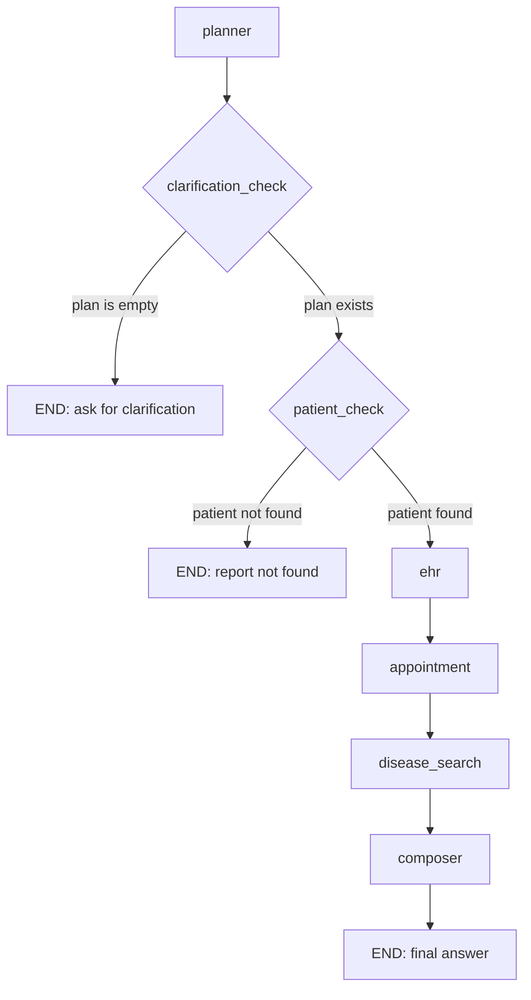

# Architecture

## Component overview

| Component | File | Responsibility |
|---|---|---|
| Planner | `src/planner.py` | Decomposes a raw query into sub-tasks, each tagged with the tool that handles it |
| Appointment tool | `src/tools/appointment_tool.py` | Finds and books doctor slots, matched by specialty |
| EHR tool | `src/tools/ehr_tool.py` | Reads and writes patient records (SQLite) |
| Disease search tool | `src/tools/disease_search_tool.py` | RAG pipeline: chunking, retrieval, grounded answer generation |
| Memory | `src/memory/vector_store.py`, `src/memory/memory_manager.py` | FAISS-backed, per-patient isolated long-term memory |
| Orchestrator | `src/graph.py` | LangGraph StateGraph wiring every node together with conditional routing |
| Evaluation | `src/evaluation/evaluator.py`, `src/evaluation/summary_report.py` | LLM-as-judge grading + operational tool-call logging |
| UI | `app/streamlit_app.py` | 5-tab dashboard: Chat, Doctor view, Medical info, Metrics, Memory & logs |

## Graph structure (as of Phase 7)

Each of `ehr`, `appointment`, and `disease_search` internally checks
`_tool_in_plan()` first and skips all work (including any LLM call) if the
planner didn't request that tool for the current query — so the straight-line
edges above don't mean every node does something on every request, only that
every node gets a turn to check whether it should.

## Request lifecycle: the sample scenario

**Input query:** "My 70-year-old father has chronic kidney disease. I want to
book a nephrologist for him. Also, can you summarize latest treatment methods?"

1. **Planner** (src/planner.py) receives the query, returns a Plan with 3 subtasks:
   - "Retrieve medical history" → tool: ehr
   - "Book nephrologist appointment" → tool: appointment
   - "Summarize latest treatment methods" → tool: disease_search

2. **EHR subtask**: get_patient_history(1) fetches John Doe Sr.'s record.
   memory_manager.get_context(1, query) pulls relevant prior context, if any.
   EHR_SUMMARY_PROMPT summarizes the record into 1-2 sentences.
   → Result: "John Doe Sr., 70, has stage 3 CKD."

3. **Appointment subtask**: find_slots("nephrology") returns available slots.
   book_slot(1, chosen_slot) books the first available nephrology slot.
   → Result: "Booked with Dr. Rao for [date/time]."

4. **Disease search subtask**: search_disease_info("latest CKD treatment methods")
   retrieves relevant chunks from the disease corpus and generates a grounded
   answer using DISEASE_ANSWER_PROMPT.
   → Result: grounded summary of CKD treatment options (ACE inhibitors, SGLT2
   inhibitors, monitoring, etc.)

5. **Composer**: all 3 results are combined via COMPOSER_PROMPT into one
   final, coherent reply mentioning the booking, a brief mention of the
   patient's condition, and the treatment summary — written naturally, not
   as three disconnected paragraphs.

## What Phase 6 needs to build

- A shared state object carrying: query, patient_id, plan, tool_results, final_answer
- One node per stage above (planner_node, ehr_node, appointment_node,
  disease_search_node, composer_node)
- Routing logic so only the subtasks the planner identified actually run
  (e.g. a booking-only query should never call disease_search_node)

## Phase 7 test scenarios

1. **Booking-only** — "Book me a cardiologist appointment next week."
   Expect: only appointment tool runs; final answer discusses only the booking.

2. **EHR-update-only** — "Add a note to my father's record: started a new
   blood pressure medication."
   Expect: only EHR tool runs; record is actually updated in the database;
   final answer confirms the update.

3. **Disease-info-only** — "What's the latest on kidney disease treatment?"
   Expect: only disease_search runs; grounded answer; no unrelated content.

4. **Unknown patient** — query references a patient_id not in the database.
   DECISION: the system stops entirely and reports the patient couldn't be
   found — it does NOT attempt booking or disease-search even if those parts
   of the query would otherwise be valid, since a request about an
   unidentifiable patient shouldn't partially proceed.

5. **Ambiguous query** — "I need help," no clear tool mapping.
   DECISION: the composer must explicitly ask "Could you tell me more about
   what you need?" rather than a generic non-answer or a fabricated response.

## What's mocked vs. real

| Piece | Status | Notes |
|---|---|---|
| LLM | Real | Google Gemini (`gemini-3.5-flash-lite`) via live API calls |
| Embeddings | Real | `sentence-transformers` (`all-MiniLM-L6-v2`), runs locally |
| Vector search | Real | FAISS, genuine similarity search |
| Doctor schedule | Mocked | `data/mock_doctors.json`, a static file standing in for a real scheduling API |
| Patient records | Semi-real | Genuine SQLite database (`data/patients.db`) with real read/write logic, but seeded with 3 fake patients rather than connected to a live EHR system |
| Disease information | Mocked | 5 offline reference documents (`data/disease_corpus/`) standing in for live Medline/WHO API calls |
| Evaluation grading | Real | Live LLM-as-judge calls, not simulated |

## Key design decisions and trade-offs

- **Per-patient memory isolation** (separate `VectorStore` per patient_id)
  was chosen over a single shared index with metadata filtering, for
  simplicity at this project's scale — trades some efficiency for
  structurally impossible cross-patient data leakage.
- **Specialty matching by word root** (`"cardiolog"` matching both
  "cardiology" and "cardiologist") was chosen over an exact keyword list,
  after discovering natural phrasing variation broke exact matching in
  Phase 7. A production system would likely use a proper medical taxonomy
  or NER model instead.
- **EHR write detection via keyword matching** on the planner's sub-task
  text, backed by an explicit planner-prompt rule instructing it to phrase
  write requests distinctly from read requests. This is a simplification —
  a more robust design would have the planner emit a structured `action:
  read | write` field directly, rather than inferring intent from free text.
- **Hardcoded clarification message** for ambiguous queries (rather than an
  LLM-generated one) ensures the exact wording is always predictable and
  testable, at the cost of being less adaptive to different kinds of
  ambiguity.
- **Operational logging via a CSV file** rather than a database was chosen
  for simplicity — sufficient for this project's scale and easy to inspect
  directly, but wouldn't scale to concurrent multi-user access.

## Known limitations

- **Gemini free-tier rate limits**: `gemini-3.5-flash-lite` is capped at 15
  requests/minute on the free tier. Running the full test suite (`pytest -q`,
  no path) back-to-back can occasionally trip this limit, since 25+ tests
  making multiple LLM calls each can burst past 15/minute. If you see a
  `GoogleRateLimitError`, wait ~60 seconds and rerun the failed test file —
  it is a timing issue, not a correctness bug. Running individual test files
  during active development (rather than the full suite) avoids this in
  practice.
- **Mocked external systems**: doctor scheduling and disease-information
  retrieval use static local files (`data/mock_doctors.json`,
  `data/disease_corpus/`) rather than live APIs — see "What's mocked vs.
  real" above.
- **Specialty and read/write detection use simple text matching** (word
  roots, keyword lists) rather than structured classification — see "Key
  design decisions and trade-offs" above for why, and what a more robust
  version would look like.
